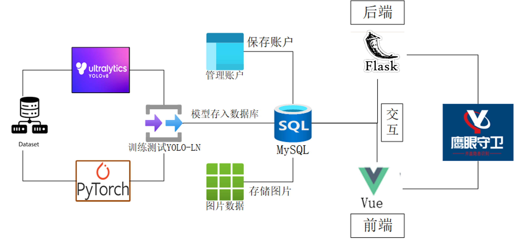
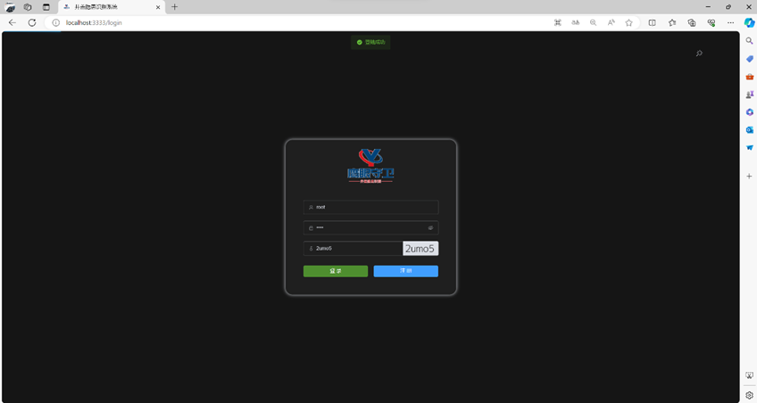
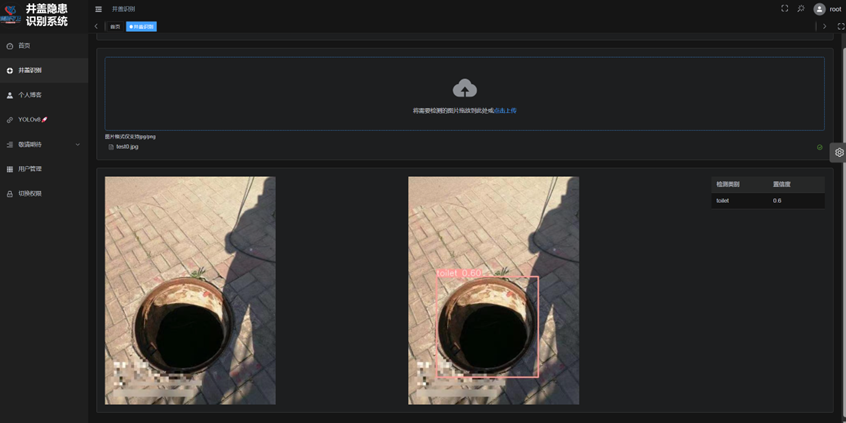
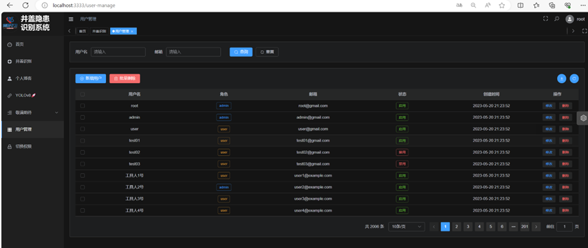
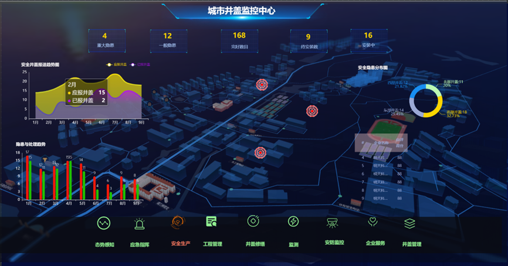
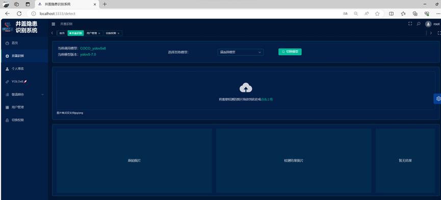

# 路面井盖缺陷检测系统 🔍

> **基于 YOLO + Flask + Vue3 + MySQL 的前后端分离 Web 项目**  
> 实时检测路面井盖缺陷，为城市基础设施安全保驾护航！

---

注意：后端检测模块的 YOLO 模型不要轻易更换（尝试过不是简简单单更换模型权重.pt 文件就可以），会报错

## 1. 项目简介 🎯

本项目旨在开发一套**路面井盖缺陷检测系统**，利用先进的 YOLO 模型实现井盖缺陷（如破损、缺失等）的自动识别。系统采用前后端分离架构：

- **后端**：基于 Flask 提供 API 接口，处理数据存储和业务逻辑。
- **前端**：基于 Vue3 实现动态交互和数据可视化展示。
- **数据库**：使用 MySQL 存储检测结果和相关信息。

该系统适用于城市道路安全管理，通过自动检测和报警，辅助管理人员及时排查隐患，提升城市安全水平。

#### 系统架构图

## 

## 2. 系统要求 💻

- **操作系统**：Windows / Linux / macOS
- **Python 版本**：建议 Python 3.8 及以上
- **Node.js**：建议 Node 版本 14+（用于前端依赖安装）
- **MySQL**：请确保已安装并配置好 MySQL 数据库

---

## 3. 项目结构 📂

```bash
.
├── mysql                   # 数据库文件夹 (.sql 文件，用于自动部署数据库)
├── backend-code            # Flask 后端代码
├── frontend-code           # Vue3 前端代码
└── README.md               # 项目说明文件
```

---

## 4. 安装与运行 🚀

### 4.1 配置 MySQL 数据库 🗄️

1. **安装 MySQL**：请先确保系统中已安装 MySQL 并配置好环境变量。
2. **部署数据库**：
   - 进入 `mysql` 文件夹，运行其中的 `.sql` 文件（可使用 MySQL Workbench 或命令行工具），自动部署所需的数据库及数据表。
3. **后端环境**：
   ```
     pip install -r requirements.txt
   ```
   后端启动还需要通过邮箱提供验证码，这个可以去网上自行寻找教程

### 4.2 启动后端服务 🔙

1. 进入 `backend-code` 文件夹：
   ```bash
   cd backend-code
   ```
2. 启动 Flask 后端：
   ```bash
   python app.py
   ```
   后端服务将启动并监听指定端口（默认为 5000）。

### 4.3 启动前端服务 🔜

1. 进入 `frontend-code` 文件夹：
   ```bash
   cd frontend-code
   ```
2. 安装前端依赖：
   ```bash
   npm install
   ```
3. 运行前端项目：
   ```bash
   npm run serve
   ```
4. 在浏览器中打开 [http://localhost](http://localhost)（或提示的 URL），即可访问系统前端界面。

### 4.3 运行结果

（1）登录界面展示，输入账号密码后即可登录系统。



（2）检测功能展示


（3）账户管理


（4）城市井盖监控平台展示（数字化平台）


（5）切换主题


---

## 5. 系统功能与特点 ⚙️

- **实时检测**  
  使用 YOLO 模型对路面井盖进行缺陷检测（如破损、缺失等），实现快速响应与报警。

- **前后端分离**  
  后端使用 Flask 构建 API 接口，前端采用 Vue3 进行数据展示和用户交互，实现灵活高效的系统架构。

- **数据管理**  
  通过 MySQL 数据库存储检测结果、用户数据及配置信息，支持数据分析与后续扩展。

- **模块化设计**  
  系统各功能模块划分明确，便于维护、升级和二次开发。

---

## 6. 技术栈 🔧

- **YOLO**：目标检测模型，负责井盖缺陷的识别
- **Flask**：后端框架，处理业务逻辑与 API 接口
- **Vue3**：前端框架，实现动态交互和数据可视化
- **MySQL**：关系型数据库，用于存储检测数据及系统信息

<details>  
  <summary>📌 点击展开技术栈详情</summary>

### 深度学习与后端

- **YOLOv5 🚀**  
  高效、准确的目标检测算法，可实时识别图像和视频中的各类对象，为井盖缺陷检测提供坚实基础。

- **PyTorch**  
  深度学习框架，提供灵活的模型构建和调试能力，是实现复杂模型训练的不二选择。

- **OpenCV**  
  功能强大的计算机视觉库，支持丰富的图像和视频处理操作，助力高效预处理和后期数据分析。

- **Flask**  
  轻量级的 Python Web 框架，用于构建后端 API 和处理业务逻辑，便于前后端分离开发。

- **Werkzeug**  
  Flask 的核心 WSGI 工具集，确保请求与响应处理的高效稳定。

- **SQLAlchemy**  
  强大的 ORM 框架，简化数据库操作，支持灵活的 SQL 构建和数据库连接池管理，提升数据操作效率。

- **Flask-Migrate**  
  数据库迁移工具，帮助开发者轻松管理数据库结构变更，确保版本升级的平滑过渡。

- **Flask-JWT-Extended**  
  基于 JSON Web Token 的认证和授权工具，提供安全、高效的用户身份验证机制。

- **Flask-WTF**  
  提供表单生成与验证功能，简化前端数据交互的开发流程，提升用户体验。

- **Flask-Mail**  
  实现电子邮件发送与验证功能，支持用户通知、注册及密码重置等流程。

- **PyMySQL**  
  纯 Python 编写的 MySQL 数据库驱动，确保后端与数据库间的高效通信。

- **MySQL 8**  
  先进的关系型数据库管理系统，支持全文索引、多源复制和强大的 JSON 数据处理，满足大规模数据存储需求。

- **Docker**  
  轻量级虚拟化技术，简化应用部署和环境管理，确保开发、测试、生产环境的一致性。

---

### 前端

- **Vue3 + script setup**  
  采用最新组合式 API 构建清晰、高效的组件逻辑，极大提升开发体验与代码可维护性。

- **Element Plus**  
  Vue3 的现代化 UI 组件库，提供丰富的界面元素，帮助快速搭建精美、统一的前端界面。

- **Pinia**  
  类型安全且易于预测的状态管理工具，替代 Vuex，实现前端状态的高效管理与调试。

- **Vite**  
  新一代前端构建工具，提供极速热更新和优化的打包速度，显著提升开发效率。

- **Vue Router**  
  高效的前端路由管理工具，支持单页面应用（SPA）的流畅页面切换。

- **TypeScript**  
  JavaScript 的超集，通过静态类型检查提高代码质量和开发效率，减少运行时错误。

- **PNPM**  
  高效的包管理工具，优化依赖安装，节省磁盘空间，加速项目构建过程。

- **Scss & CSS 变量**  
  使用 Scss 结合 CSS 变量管理项目样式，实现灵活统一的布局和配色控制。

- **UnoCSS**  
  高性能即时原子化 CSS 引擎，支持灵活自定义样式，满足快速开发需求。

- **ESLint & Prettier**  
  分别用于代码校验和格式化，确保整个项目的代码风格统一、规范，提升代码质量。

- **Axios**  
  简洁高效的 HTTP 客户端，负责前后端数据交互，支持各种网络请求操作。

- **兼容移动端**  
  前端布局设计充分考虑移动设备分辨率，确保在各平台下均有出色的用户体验。

</details>

---

## 7. 注意事项 & 其他说明 📌

- **环境配置**：请确保所有依赖环境（Python、Node.js、MySQL）均已正确安装与配置。
- **调试问题**：若在运行过程中遇到问题，请查看对应模块的日志信息，或在 GitHub 上提交 Issue。
- **贡献建议**：欢迎 Star、Fork、Issue 以及 PR，期待大家的积极参与！
- **感谢**：前端参考 https://github.com/FlatWhite233/yolov5_garbage_detect 、ultralytics 官网: https://github.com/ultralytics/ultralytics

该项目是完整的 AI+行业应用的实践项目，可将其包装为毕设、竞赛、大创等项目（更换任务如其他什么检测之类），具体的自行发挥。

本人是一名本科生，通过设计类似或者更高级的实践项目获得过国奖 4 项，省部级奖项 10 余项，后续可提供相关咨询服务

----更新（2025 年 3.15）----
目前正在准备夏令营适宜，比较忙碌，暂时不接受项目竞赛等咨询

---

🚀 **欢迎 Star & Fork 支持本项目！**  
🚀 **Feel free to star and fork this project!**
💖 **感谢关注，祝使用愉快！** 💖
